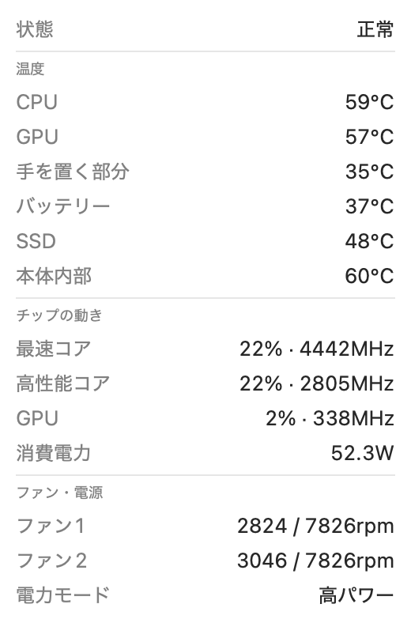

# 熱モニター

Mac の温度・ファン・消費電力とサーマルスロットリング状態をメニューバーに表示する小さなアプリです。



## 動作環境

- Apple Silicon 搭載 Mac
- macOS 14 以降

## インストール

1. [Releases](../../releases) から `ThermalBar.zip` をダウンロードして展開
2. `熱モニター.app` を「アプリケーション」フォルダへ移動
3. 初回は「開発元を確認できない」と開けません。「システム設定 > プライバシーとセキュリティ」に出る「このまま開く」を押してください（Apple の公証をしていない無料配布のため）

## 使い方

- 左クリック: 詳細パネルを開閉
- 右クリック（または control+クリック）: メニュー（「ログイン時に起動」「終了」）

## 表示の意味

- 状態: macOS の熱の段階（Nominal〜Sleeping）を日本語で表示。「速度低下中」以上がサーマルスロットリングです
- メニューバーの丸: 🟢正常 🟡やや高い 🔴速度低下中〜 ⚪不明
- 温度のセンサー名は機種により異なり、取れない項目は「—」と表示します

## ソースからビルド

```sh
brew install macmon
./build.sh          # ~/Applications/熱モニター.app へ配置
./build.sh --selftest  # センサー単体の動作確認
```

## 同梱物のライセンス

- macmon: MIT License — https://github.com/vladkens/macmon

## ライセンス

MIT
